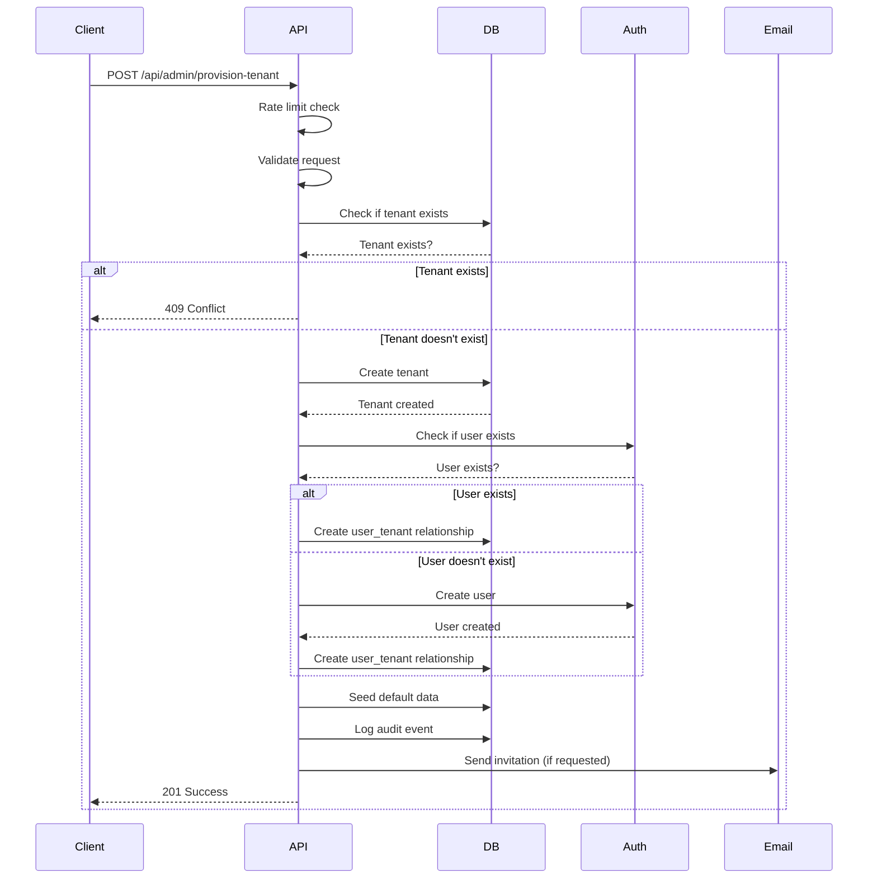

# Tenant Provisioning Flow

This document describes the tenant provisioning process, including the API flow, error handling, and rollback procedures.

## Overview

The tenant provisioning system allows platform administrators to create new tenants with owners in a single atomic operation. This includes:

1. Creating a tenant record
2. Creating or finding a user account for the owner
3. Assigning the owner to the tenant
4. Seeding default data (branding, pricing)
5. Logging audit events
6. Sending invitation emails (optional)

## API Endpoint

**POST** `/api/admin/provision-tenant`

### Request Body

```json
{
  "tenant": {
    "name": "London Airport Parking",
    "slug": "london-airport-parking",
    "timezone": "Europe/London",
    "capacity": 100
  },
  "owner": {
    "email": "owner@example.com",
    "invite": true
  }
}
```

### Response

**Success (201):**
```json
{
  "success": true,
  "tenantId": "uuid",
  "ownerUserId": "uuid",
  "invited": true,
  "message": "Tenant 'London Airport Parking' created successfully and owner invited"
}
```

**Error (400/409/500):**
```json
{
  "error": {
    "code": "TENANT_EXISTS",
    "message": "Tenant with this slug already exists",
    "details": {
      "slug": "london-airport-parking"
    }
  }
}
```

## Error Codes

| Code | Status | Description |
|------|--------|-------------|
| `RATE_LIMIT_EXCEEDED` | 429 | Too many requests |
| `VALIDATION_ERROR` | 400 | Invalid request data |
| `TENANT_EXISTS` | 409 | Tenant slug already exists |
| `TENANT_CREATION_FAILED` | 500 | Failed to create tenant |
| `USER_CREATION_FAILED` | 500 | Failed to create user account |
| `OWNER_ASSIGNMENT_FAILED` | 500 | Failed to assign owner |
| `AUTH_ERROR` | 500 | Authentication service error |
| `INTERNAL_ERROR` | 500 | Internal server error |

## Flow Diagram



## Rollback Procedures

If any step fails after tenant creation, the system automatically rolls back:

1. **User creation fails**: Delete the created tenant
2. **Owner assignment fails**: Delete the created tenant
3. **Default data seeding fails**: Continue (non-critical)
4. **Audit logging fails**: Continue (non-critical)
5. **Email sending fails**: Continue (non-critical)

## Rate Limiting

- **Window**: 15 minutes
- **Limit**: 5 requests per IP
- **Headers**: `X-RateLimit-Limit`, `X-RateLimit-Remaining`, `X-RateLimit-Reset`

## Security Considerations

1. **Platform Admin Only**: Only platform administrators can create tenants
2. **Rate Limiting**: Prevents abuse and DoS attacks
3. **Input Validation**: Strict validation of all inputs
4. **Audit Logging**: All actions are logged for compliance
5. **Service Role**: Uses service role for database operations (bypasses RLS)

## Testing

### cURL Examples

**Create tenant with invitation:**
```bash
curl -X POST http://localhost:3000/api/admin/provision-tenant \
  -H "Content-Type: application/json" \
  -H "Cookie: your-auth-cookie" \
  -d '{
    "tenant": {
      "name": "Test Parking",
      "slug": "test-parking",
      "timezone": "Europe/London",
      "capacity": 50
    },
    "owner": {
      "email": "test@example.com",
      "invite": true
    }
  }'
```

**Create tenant without invitation:**
```bash
curl -X POST http://localhost:3000/api/admin/provision-tenant \
  -H "Content-Type: application/json" \
  -H "Cookie: your-auth-cookie" \
  -d '{
    "tenant": {
      "name": "Test Parking 2",
      "slug": "test-parking-2",
      "timezone": "Europe/London",
      "capacity": 100
    },
    "owner": {
      "email": "test2@example.com",
      "invite": false
    }
  }'
```

### Test Scenarios

1. **Valid request**: Should return 201 with tenant and owner IDs
2. **Duplicate slug**: Should return 409 with conflict details
3. **Invalid email**: Should return 400 with validation errors
4. **Rate limit exceeded**: Should return 429 with rate limit headers
5. **Non-admin user**: Should return 403 with forbidden message

## Monitoring

- **Success Rate**: Monitor 201 responses vs total requests
- **Error Rate**: Monitor 4xx/5xx responses
- **Rate Limiting**: Monitor 429 responses
- **Audit Logs**: Check for failed operations
- **Email Delivery**: Monitor invitation email success rates
